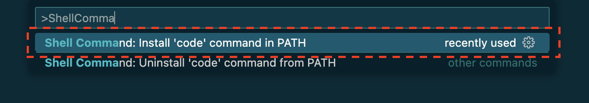

# Battery Swapping System
This repository contains Team 5's EV battery swapping project code

## Software Pre-requisites:

* Python 3.8 or above
* Vscode editor

## Setting up the development environment:

For MacOS users: To run `code` command in terminal you need to expose vscode path:
1. Open Vscode
2. Command+Shift+P
3. Type ">Shell Command" in the textbox popup.
4. Select the option as shown below:



```
$ git clone https://github.com/pushp1997/battery-swapping-system.git

$ cd battery-swapping-system

$ python -m venv env

$ source env/bin/activate

# For windows use the following command:
$ .\env\Scripts\Activate.ps1

$ pip install -r requirements.txt

$ code battery-swapping-system.code-workspace
```

## To run dev server:
```
$ cd battery-swapping-system

$ docker-compose up
```

Now go to [localhost:8000](http://localhost:8000/) in your browser

## Common Errors:

Even after mysql logs show that its listeting for connections but [localhost:8000](http://localhost:8000/) is not workign for you, then in your terminal:

```
$ cd battery-swapping-system

$ docker-compose restart app
```
